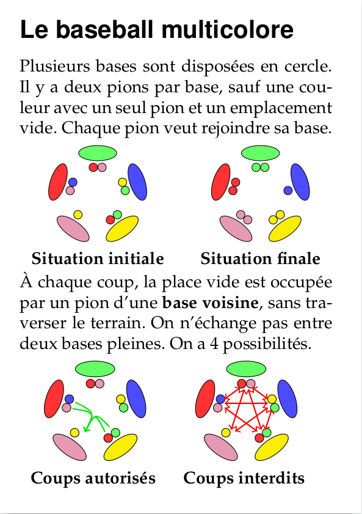
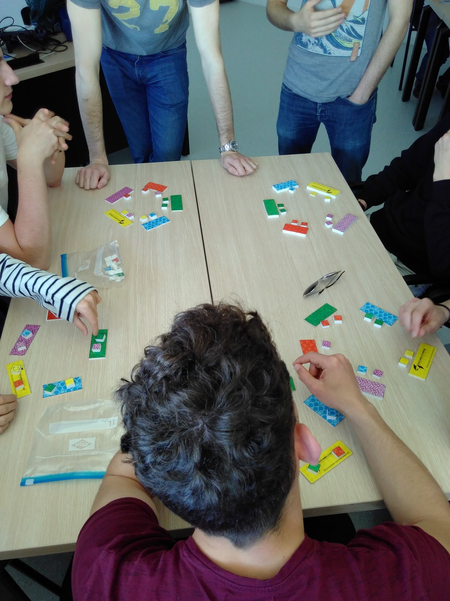
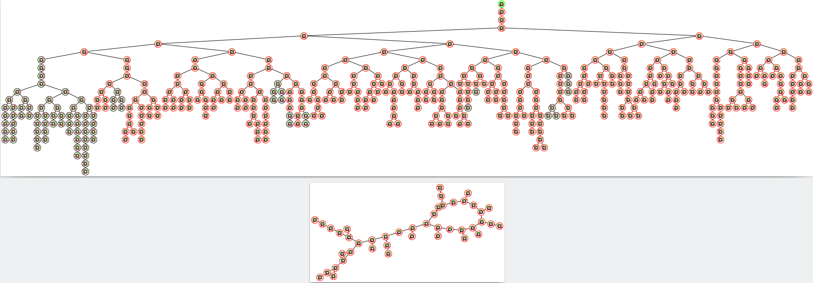
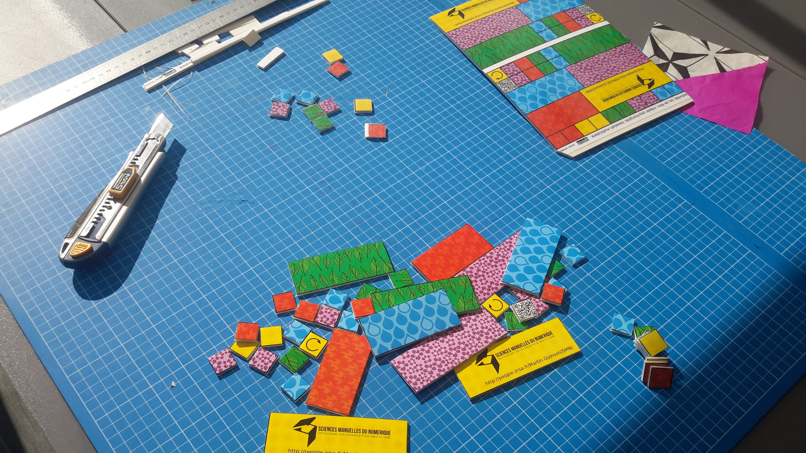

# Baseball multicolore

Découverte de la notion d'algorithme au travers d'un petit puzzle

## Présentation de l'activité

5 bases de couleurs différentes, 9 pions (2 par couleur + un pion seul). Répartition aléatoire des pions,
qu'il faut ranger avec des contraintes sur les déplacements.

{#id .class width=300}
{#id .class width=300}

Trouver un algorithme n'est pas trivial simple alors on en propose un aux participants avec la réflexion suivante : ce qui est difficile pour
l'ordinateur, c'est qu'il y a quatre possibilités à chaque étape. Il ne sait pas choisir seul. Fixons un sens pour tourner, il reste deux
possibilités. Entre les deux, on prend la couleur qui a le plus de route à faire. Et hop, on a un algorithme qu'on peut tester en direct.

Sauf que ... cet algorithme est faux : dans certaines situations initiales, l'algorithme tourne à l'infini (inversez deux pions d'une situation triée
pour voir). C'est l'occasion de parler de preuve de programmes, où il faut la correction (OK ici) ET terminaison (pas garantie ici).

Truc d'animatrice pour être (probablement) dans un cas où l'algo marche malgré tout et assurer un effet de surprise pour la suite : pas de pions déjà
dans sa maison, et jamais deux pions identiques ensemble. Je sais que ce truc fonctionne car j'ai calculé tous les cas, comme un bourrin
d'informaticien :)

Le schéma suivant ([version zoomable](baseball.pdf)) représente le graphe de toutes les situations du jeu pour 4 couleurs. Chaque petit rond est une
situation donnée, et elle est reliée par une flèche allant vers la situation qu'on obtient en appliquant cet algorithme. En haut de la figure, on a un
arbre, avec la situation triée tout en haut de l'arbre. L'algorithme marche dans tous ces cas. En dessous, certaines situations sont déconnectées de
l'arbre et forment un cycle infini.

{#id .class width=500}

Certains petits ronds sont cerclés de noir car ils respectent le critère de prestidigitatrice "personne à la maison; pas deux de la même couleur dans
la même base" et d'autres sont cerclés de rouge car ils ne respectent pas ce critère. On constate que tous les ronds cerclés de noirs trouvent dans
l'arbre qui converge vers la solution et aucun dans la partie qui boucle à l'infini. C'est la "preuve" que la prestidigitation proposée fonctionne
bien dans ce cas. Si vous avez 7 couleurs ou plus, la règle n'est plus infaillible, mais on garde de grande chance que cela fonctionne encore.

{#id .class width=300}

Nim, crépier et baseball forment une belle séquence sur les algorithmes, souvent joués dans cet ordre. On l'a testé avec des participants de 9 à 99
ans (élèves, profs de maths, ou à la fête de la science avec le "moyen public" qui y vient), sur une heure ou plusieurs séances. Le matériel plein de
couleurs (mais accessible aux daltoniens) pour les 3 activités est facile à coller sur du carton plume avant découpe. Il y a un livret du participant,
celui de l'animatrice, des vidéos démo, etc. Tout est sur [cette page](http://people.irisa.fr/Martin.Quinson/Mediation/SMN). C'est sous licence
CC-BY-SA pour que vous vous en serviez. 

Benjamin Wack a fait un [simulateur en ligne](https://www-verimag.imag.fr/~wack/baseball), pratique pour faire des démos sur le videoprojecteur. C'est
tellement utile que le groupe Maths à modeler de Lyon a fait un [autre simulateur](https://projet.liris.cnrs.fr/mam/valise/#baseball) de cette
activité. 
