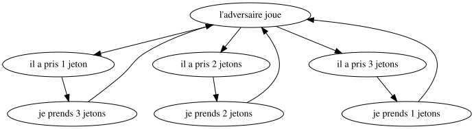

<!-- Page de titre -->

<h1 align="center" style="font-size: 3em; font-weight: bold;">Compte rendu (NIM)</h1>

William Hasley &
Nowar Kazem

<!-- Sommaire -->

# Sommaire

- [Présentation de l'activité](#présentation-de-lactivité)
- [Enjeu choisi](#enjeu-choisi)
- [Rapport de la séance](#rapport-de-la-séance)

# Présentation de l'activité

Pour cette activité, nous avons choisi le jeu de Nim (version simple, sans extension). L’objectif était de 
faire découvrir aux élèves la théorie des jeux, la notion d’algorithme et celle de stratégie gagnante. 
Nous avons utilisé du matériel déjà existant, et chaque groupe a reçu 12 jetons.

Pour cette activité nous avons choisi l'organisation suivante : 
1. Présentation de Nous, puis présentation de l'activité.
2. Répartition des élèves en binômes et distribution du matériel.
3. Les élèves ont d’abord joué librement entre eux. Nous sommes intervenus de temps en temps pour les amener à réfléchir à une manière de gagner à coup sûr.
4. Ensuite, nous avons repris l’attention du groupe pour jouer contre les élèves qui pensaient pouvoir toujours gagner. 
   Cela nous a permis de montrer qu’il existe une stratégie gagnante.
5. Nous avons ensuite regroupé les élèves en îlots (groupes de quatre) et leur avons demandé de décrire précisément la stratégie gagnante.
6. Institutionnalisation + Trace écrite + Questions.

# Enjeu choisi

<u>**VERSION PROF:**</u> C’est de l’informatique, parce qu’on cherche une stratégie qui permette de gagner à coup sûr,
une stratégie automatique = un algorithme (liste d’instructions, comme une recette de cuisine).

La stratégie du jeu de Nim : Quand ton adversaire prend des pions, tu peux toujours compléter
pour qu’à vous deux, vous ayez pris 4 pions (s’il en prend 1, tu prends 3, 2 tu prends 2, 3 tu prends
1). Il faut donc regrouper les pions en groupes de 4, et tu pourras toujours prendre le dernier, car
12 = 4x3 : il y a 3 groupes de 4 jetons. Si l’adversaire commence, tu es donc sûr de pouvoir gagner,
on dit que tu as une stratégie gagnante ! Mais si on ajoute des jetons, ça change. . .

Chercher une stratégie gagnante dans un jeu à 2 joueurs, c’est un domaine de l’informatique
appelé la théorie des jeux. Le but, c’est de construire un algorithme qui te bat à tous les coups !
Mais ça n’est pas possible avec tous les jeux : s’il y a du hasard, comme à la bataille par exemple, ça
ne marche pas : l’ordinateur ne peut pas choisir les cartes qui vont être retournées, c’est aléatoire.
Exemples de jeu à 2 sans hasard ? (morpions. . .)

Quand on cherche à écrire la stratégie gagnante, il faut être super précis : dans notre jeu, il faut
bien dire quand/pourquoi on prend 1, 2 ou 3 jetons, sinon ça ne marche pas. C’est pareil pour tous
les algorithmes : l’ordinateur fait exactement ce qu’on lui dit de faire, rien de plus, il ne peut rien
deviner. Pour faire ça, on ne lui parle pas en français, mais dans un langage dit de programmation
(ex : scratch) : il y a des instructions de base (ex : addition), et on les liste, pour que l’ordinateur
sache exactement ce qu’on lui demande.

<u>**VERSION ÉLÈVE**:</u> On a réfléchi à ce qu'on appelle une stratégie gagnante : C'est un ensemble 
de règles qui nous permet de gagner à tous les coups. Avec ces règles, on s'est rendu compte qu'on 
pouvait toujours gagner si on jouait en deuxième.

Ceci est un algorithme, c'est-à-dire une suite d'instructions précises qu'un ordinateur peut comprendre 
et reproduire. On a vu avec l'exemple du robot qu'il est nécessaire d'être précis lorsqu'on donne des 
instructions à l'ordinateur.

# Rapport de la séance

La séance s’est bien passée dans l’ensemble. L’ambiance était calme, la classe bien organisée, 
et les élèves étaient motivés. Ils ont commencé à jouer, et une certaine compétition est vite apparue 
dans certains groupes. Certains élèves ont été déçus de perdre souvent. Pour les remotiver, nous avons 
décidé de jouer contre celui qui gagnait tout le temps, en utilisant la stratégie gagnante. 
Cela a permis de leur montrer qu’il existe vraiment une façon de gagner.

Nous avons aussi joué au tableau contre ceux qui pensaient pouvoir gagner à tous les coups. Beaucoup 
d’élèves voulaient venir au tableau (ce qui a rendu le choix difficile), et certains étaient très sûrs 
d’eux. Il a donc fallu bien expliquer pourquoi leur stratégie ne fonctionnait pas, avec des contre-exemples 
pour que ce soit plus clair.

La présence d’un groupe de soutien nous a beaucoup aidés. Les élèves ont commencé à être étonnés qu’on 
gagne à chaque fois. Ce moment de surprise était parfait pour leur faire comprendre qu’il existe une stratégie 
gagnante. Ils ont bien compris cette stratégie, ainsi que le lien avec l’informatique. Par contre, certains 
ont été un peu déçus en apprenant qu’on ne peut pas appliquer cette méthode à tous les jeux.

Un point surprenant a été le respect strict des consignes données. Par exemple, lors d’une première 
démonstration au tableau, nous avions placé les jetons en ligne droite (plutôt qu’en carré). 
Les élèves ont alors, tout au long de la séance, reproduit ce placement en ligne droite.

