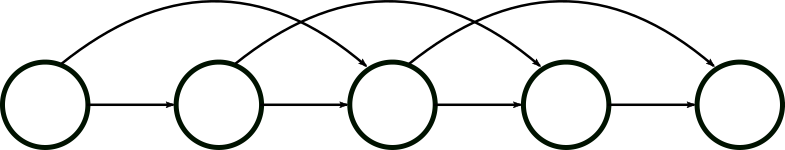
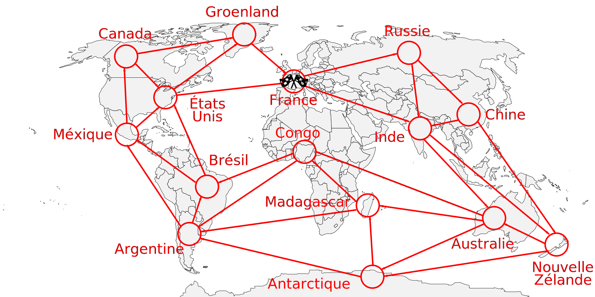

# Apprentissage par Renforcement sur une version étendue du jeu de Nim

## Contexte

L'idée ici est de créer une activité reprenant les principes de l'apprentissage
par renforcement, qui a déjà été testé sur le jeu de Nim. (lien à ajouter)

L'apprentissage est présenté comme suit :
* Un robot, contre lequel les joueurs jouent est modélisé par un ensemble de
gobelets
* Les gobelets représentent les différents états du jeu de Nim
* Ils sont remplis de jetons, modélisant les choix possibles du robot dans un
état
* Au tour du robot, on tire dans un gobelet un jeton, qui indique l'action du
robot
* Les joueurs effectuent tour à tour des parties contre le robot
* Le robot apprend en faisant évoluer les jetons au fur et à mesure des parties

Le robot à gobelets est capable d'apprendre la stratégie gagnante sur une
version simplifiée du jeu de Nim (par exemple avec 8
bâtonnets, et le choix de prendre 1 ou 2 bâtonnets) sur laquelle les joueurs
trouvent rapidement comment gagner au jeu, d'instinct, mais sans forcément
comprendre les
principes cachés derrière. Une version intéressante du jeu pour les joueurs,
étant trop complexe pour que le robot à gobelets apprenne en temps limité.

## Idée

On propose ici, un jeu plus intéressant pour les joueurs, basé sur le jeu de
Nim. On veut y appliquer de l'apprentissage par renforcement, avec le
robot à gobelets. Pour cela, nous proposons de changer le graphe du jeu, en le
rendant irrégulier, et donc non-trivial.

Le jeu se jouerait sur un plateau, sur lequel un graphe
orienté est représenté.
Les joueurs y déplacent un pion, et doivent l'amener à bon port.

### Principe du jeu

* Les deux joueurs sont dans un véhicule qu'ils controlent (représenté par un
unique pion)
* Chaque joueur joue chacun son tour. L'un le jour, l'autre la nuit
* Ils déplacent le pion le long d'une arête reliant deux nœuds du graphe
* Le gagnant est celui qui parvient à effectuer le déplacement amenant le
véhicule sur une case représentant l'arrivée

Le principe du jeu est donc globalement de se rapprocher d'un objectif commum,
ensemble, mais d'être celui qui effectuera le dernier déplacement. Les joueurs
devront donc essayer de prendre des détours, pour éviter que leur partenaire et
adversaire ne gagne.

### Graphes et difficulté

Un avantage de ce jeu est de pouvoir changer le graphe a volonté.
Le changer offre de nombreux points :

* Faire varier la difficulté
* Faire évoluer les stratégies des joueurs
* Renouveler le plaisir des joueurs, en changeant de temps en temps de
graphe/plateau de jeu
* On peut aussi placer les nœuds et arêtes à différents endroits du plateau pour
donner du contexte au jeu

Pour commencer, les joueurs peuvent commencer par un graphe simple, comme celui
représentant le jeu de Nim.

Par la suite, on peut proposer aux joueurs des graphes de plus en plus complet.

### Des contextes possibles

Ici, nous présentons des exemples de scénarios que l'on peut expliquer aux élèves
avant de jouer.
Utiliser plusieurs scénarios à l'avantage, là encore de créer du renouvellement
dans l'activité. Les élèves découvrent une nouvelle histoire, un nouveau
plateau, permettant ainsi de limiter l'ennui.

Le jeu reste cependant le même. On peut même envisager de garder le même graphe,
mais en changeant le contexte ainsi que les positions des nœuds du graphe
sur le plateau.

En revanche, un point négatif est qu'il est nécessaire d'expliquer les contextes
avec une personne. Il serait nécessaire d'expliquer l'histoire à chaque fois
que des élèves changent de contextes.

#### Le tour du monde

Deux explorateurs partent faire un tour du monde à bord de leur dirigeable.
Ils se relaient nuit et jour afin d'avancer le plus vite.
Cependant, un seul des deux recevra les félicitations de son pays et connaitra
la gloire : celui qui ramènera le véhicule dans le pays de départ (la France).
Ils parcourent alors l'ensemble des continents : l'Europe, l'Asie, l'Océanie,
l'Afrique, ainsi que l'Amérique du Sud et du Nord.

#### Le tour de France

Le scénario est le même que le précédent, mais à échelle différente, celle de la
France. Ici, les joueurs visitent les villes de France, et doivent revenir vers
Paris.

### Présentation de l'activité

TODO
