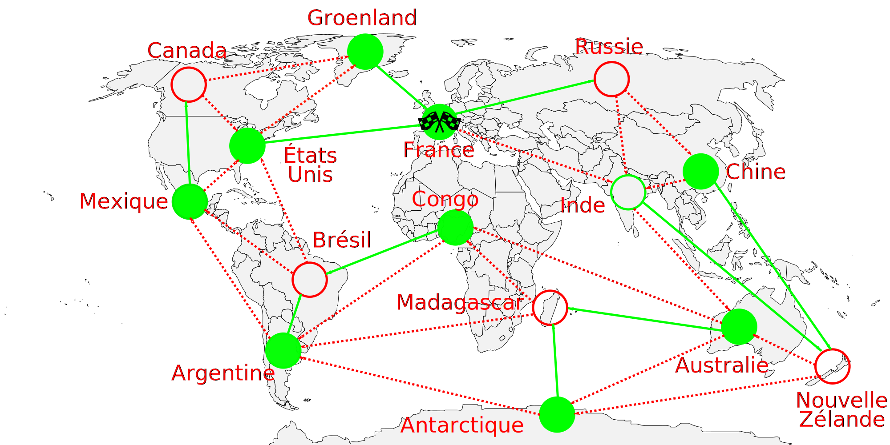

# Apprentissage par Renforcement sur une version étendue du jeu de Nim

## Contexte

L'idée ici est de créer une activité reprenant les principes de l'apprentissage
par renforcement, qui a déjà été testé sur le jeu de Nim. (lien à ajouter)

L'apprentissage est présenté comme suit :
* Un robot, contre lequel les joueurs jouent est modélisé par un ensemble de
gobelets
* Les gobelets représentent les différents états du jeu de Nim
* Ils sont remplis de jetons, modélisant les choix possibles du robot dans un
état
* Au tour du robot, on tire dans un gobelet un jeton, qui indique l'action du
robot
* Les joueurs effectuent tour à tour des parties contre le robot
* Le robot apprend en faisant évoluer les jetons au fur et à mesure des parties

Le robot à gobelets est capable d'apprendre la stratégie gagnante sur une
version simplifiée du jeu de Nim (par exemple avec 8
bâtonnets, et le choix de prendre 1 ou 2 bâtonnets) sur laquelle les joueurs
trouvent rapidement comment gagner au jeu, d'instinct, mais sans forcément
comprendre les
principes cachés derrière. Une version intéressante du jeu pour les joueurs,
étant trop complexe pour que le robot à gobelets apprenne en temps limité.

## Idée

On propose ici, un jeu plus intéressant pour les joueurs, basé sur le jeu de
Nim. On veut y appliquer de l'apprentissage par renforcement, avec le
robot à gobelets. Pour cela, nous proposons de changer le graphe du jeu, en le
rendant irrégulier, et donc non-trivial.

Le jeu se jouerait sur un plateau, sur lequel un graphe
orienté est représenté.
Les joueurs y déplacent un pion, et doivent l'amener à bon port.

### Principe du jeu

* Les deux joueurs sont dans un véhicule qu'ils controlent (représenté par un
unique pion)
* Chaque joueur joue chacun son tour. L'un le jour, l'autre la nuit
* Ils déplacent le pion le long d'une arête reliant deux nœuds du graphe
* Le gagnant est celui qui parvient à effectuer le déplacement amenant le
véhicule sur une case représentant l'arrivée

Le principe du jeu est donc globalement de se rapprocher d'un objectif commum,
ensemble, mais d'être celui qui effectuera le dernier déplacement. Les joueurs
devront donc essayer de prendre des détours, pour éviter que leur partenaire et
adversaire ne gagne.

### Graphes et difficulté

Un avantage de ce jeu est de pouvoir changer le graphe a volonté.
Le changer offre de nombreux points :

* Faire varier la difficulté
* Faire évoluer les stratégies des joueurs
* Renouveler le plaisir des joueurs, en changeant de temps en temps de
graphe/plateau de jeu
* On peut aussi placer les nœuds et arêtes à différents endroits du plateau pour
donner du contexte au jeu

Pour commencer, les joueurs peuvent commencer par un graphe simple, comme celui
représentant le jeu de Nim.

Par la suite, on peut proposer aux joueurs des graphes de plus en plus complet.

### Des contextes possibles

Ici, nous présentons des exemples de scénarios que l'on peut expliquer aux élèves
avant de jouer.
Utiliser plusieurs scénarios à l'avantage, là encore de créer du renouvellement
dans l'activité. Les élèves découvrent une nouvelle histoire, un nouveau
plateau, permettant ainsi de limiter l'ennui.

Le jeu reste cependant le même. On peut même envisager de garder le même graphe,
mais en changeant le contexte ainsi que les positions des nœuds du graphe
sur le plateau.

En revanche, un point négatif est qu'il est nécessaire d'expliquer les contextes
avec une personne. Il serait nécessaire d'expliquer l'histoire à chaque fois
que des élèves changent de contextes.

#### Le tour du monde

Deux explorateurs partent faire un tour du monde à bord de leur dirigeable.
Ils se relaient nuit et jour afin d'avancer le plus vite.
Cependant, un seul des deux recevra les félicitations de son pays et connaitra
la gloire : celui qui ramènera le véhicule dans le pays de départ (la France).
Ils parcourent alors l'ensemble des continents : l'Europe, l'Asie, l'Océanie,
l'Afrique, ainsi que l'Amérique du Sud et du Nord.

#### Le tour de France

Le scénario est le même que le précédent, mais à échelle différente, celle de la
France. Ici, les joueurs visitent les villes de France, et doivent revenir vers
Paris.

### Des stratégies gagnantes

Chaque jeu, c'est à dire chaque contexte a les mêmes principes. Se déplacer sur un plateau (représenté par un graphe) le long de trajets (arrêtes, ou transition du graphe) et être celui qui fera le trajet final vers l'arrivée. Pour chaque plateau, il existe une stratégie permettant de gagner à coup sur (En revanche, cela dépend de quel joueur commence.). Quelque soit les actions que l'adversaire va alors jouer, la stratégie gagnante lui permettra toujours de gagner.

Pour expliquer cela, prenons l'exemple du tour du monde. Pour rappel, les joueurs commencent en France et doivent décider quels trajets suivre pour effectuer le tour du monde et revenir en France.

Les cercles verts représentent les positions où le joueur qui va jouer peut forcément gagner. Les disques (cercles pleins) rouges représentent quand à eux les positions ou quelque soit le trajet suivi, l'autre joueur peut forcément gagner.

Pour commencer, dans le cas du Groenland ou des États Unis, le joueur n'a qu'a suivre le trajet qui l'emmène directement en France, et il gagne. Ces deux cases sont donc des **positions gagnantes** pour le joueur. En revanche, si le joueur se situe actuellement au Canada, il peut aller soit aux États Unis, soit au Groenland. Dans les deux cas, il ammène l'autre joueur dans une position gagnante. Le canada est alors dit comme étant une **position perdante**. Continuons : depuis le Mexique, le joueur peut soit choisir de suivre le trajet vers le Canada soit vers les États Unis. S'il ammène son adversaire aux États Unis, l'adersaire est alors sur une position gagnante, et peut alors gagner le jeu. En revanche, si le joueur choisit d'aller au Canada, son adversaire se retrouve alors dans une position perdante. Cela assure alors au joueur sa victoire.

On peut alors définir position gagnante et position perdante de la manière suivante :

* Une **position gagante** est une position depuis laquelle le joueur peut choisir un trajet qui le fait soit gagner immédiatement, soit qui ammène son adversaire vers une position perdante.
* Une **position perdante** est une position depuis laquelle, quelque soit l'action du joueur, le trajet choisi ammène son adversaire sur une position gagnante.

Partant de ces définitions, on peut alors établir l'ensemble des positions gagnantes et des positions perdantes en parcourant petit à petit le plateau en sens inverse. L'image ci-dessus illustre le résultat que l'on obtient sur ce plateau. On observe sur ce plateau que la case départ est une position gagnante. Dans ce cas le joueur qui commence possède une stratégie gagnante. S'il l'applique (en suivant les flèches vertes continues), il gagnera forcément le jeu. Si la case départ est une position perdante, l'adversaire du joueur dispose alors d'une stratégie gagnante. Dans ce cas, il faut que l'adversaire commence pour gagner. 

### Simulations d'apprentissage

Cette partie concerne des simulations d'apprentissage de gobelets.
Le but étant de voir quelles sont les bonnes façons d'apprendre les gobelets, comment entrainer le plus rapidement possible.
Un début de simulateur a été réalisé, cependant, il reste encore à le compléter.

Pour la carte du monde, avec un apprentissage dans lequel chaque partie perdue enlève la dernière transition réalisée, il faut perdre 18 parties pour apprendre complétement et parfaitement le jeu. (18 étant le nombre de transitions perdantes).

### Présentation de l'activité

Le but de cette section est de présenter une ébauche de fiche d'activité, ainsi que des idées qui peuvent être, ou non mise en place.

#### Explications du jeu (5 minutes)

Dans un premier temps, on présente le principe du jeu aux élèves.
* On peut montrer une partie en direct, pour expliquer.
* On peut inviter des élèves à faire une démonstration du jeu, comprendre les difficultés et les expliquer.

#### Appropriation de l'activité (10 minutes)

Ensuite, on invite les enfants à s'approprier le principe du jeu en jouant ensemble deux par deux pendant un certain temps.
* On peut les placer par groupe de 4/6, en îlots.
* On peut alterner les adversaires, ...

#### Début d'explications et Introduction du robot (5 minutes)

On reprend les enfants, et on leur explique le fait que l'on rajoute un robot à gobelets.
On peut aussi parler de certains points avec les élèves comme des débuts d'idées sur des stratégies gagnantes

#### Suite de l'activité (20 minutes)

Pour la suite, l'idée étant qu'il y ai une table avec le robot à gobelet contre lequel les enfants/groupes d'enfants jouent en se relayant. Chaque partie jouée permet ainsi d'entrainer un peu plus le robot à gobelets. L'objectif étant de bien gérer le temps pour qu'avant la fin de l'activité, le robot est complétement appris la stratégie gagnante.

Pendant ce temps, il faut occuper les autres groupes. Le but serait que les groupes cherchent à comprendre la stratégie gagnante, ainsi qu'une manière pour la trouver. Pour les occuper, on peut changer les plateaux de jeux pour renouverler leur attention, en revanche, cela peut les ralentirs dans les objectifs. On peut eventuellement envisager des plateaux à difficulté croissante, qui aident à comprendre le principe de stratégie gagnante.

#### Conclusion de l'activité (5 minutes)

Enfin, pour conclure, l'idée serait de montrer que les gobelets sont capables de battre n'importe qui, de conclure sur l'idée de stratégie gagnate, d'expliquer pourquoi c'est de l'info, ...

#### Expliquer pourquoi c'est de l'informatique (5 minutes)

En fin de séance, il nous est demandé d'expliquer pourquoi l'activité que l'on a réalisée traitait d'un sujet de l'informatique. Ici, on donne plus des idées que des points définitifs:
* Le principe de stratégies gagnantes.
* Le principe d'apprentissage

Des applications de la vie réelles qui peuvent parler aux élèves, dans le but de démystifier les technologies cachées derrières :
* Les applications de reconnaissance vocale, que ce soit dans les téléphones (Syrie, Ok Google), ou les assistants vocaux à la maison (Google Home, Alexa). Même si ce n'est pas de l'apprentissage par renforcement. Mais l'activité peut viser à expliquer l'apprentissage plus que la sous-catégorie de l'apprentissage par renforcement
* Les voitures autonomes. Idem, ce n'est pas de l'apprentissage par renforcement.

### Sources

* https://members.loria.fr/MDuflot/files/med/IAnim.html
* https://projet.liris.cnrs.fr/lirismed/index.php?id=la-machine-qui-apprend-a-jouer-toute-seule
* http://www.tangente-education.com/article.php?art=4076&dos=158

### Idées d'extension

Ici, on place des idées qui pourraient servir à améliorer l'activité, mais qui seraient surtout à étudier voir si c'est possible, et bénéfiques à l'activité:

* des plateaux différents et des contextes différentes
